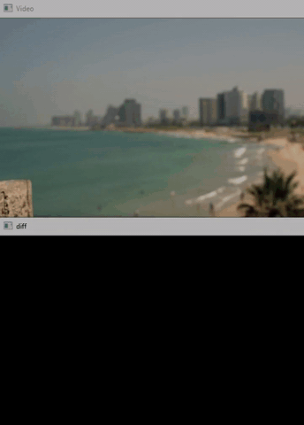
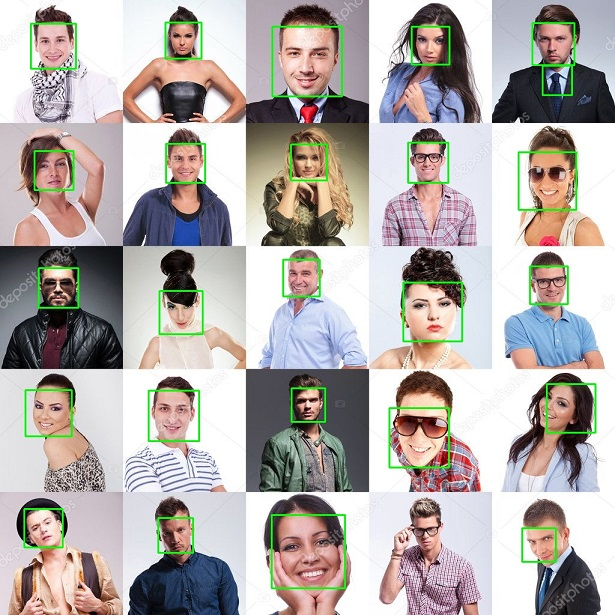

# opencv-utils

A collection of useful OpenCV utility classes and functions for basic computer vision use cases. 

#
### Dependencies

The following packages are required to run these programs:

* `python 3.6`
* `opencv-python v3.4.3`
* `numpy v1.15.2`

#
### Usage

#### Video Stream
The stream class is a wrapper for the opencv video capture class, which initialises the capture on a separate thread, thus preventing video i/o from slowing down the primary logic thread.

```markdown
from stream import Stream

# initialise stream from primary source 0
capture = Stream(src=0).start()

# grab a frame
ret, frame = capture.read()

# release the capture when done
capture.release()
```

#### FPS
The FPS class provides basic frames/second calculation using the native datetime module
```markdown
from fps import FPS

# start the timer
fps = FPS().start()

# update every time a frame is processed
fps.update()

# get approximate result
fps.fps() // 123.45
```

#### Motion Detector
This is a simplistic implementation of motion detection using background subtraction. The absolute difference between to successive frames is processed to obtain <em>motion</em>. The closed contours are then found to obtain a list of detected moving objects in the video stream.
```markdown
from motion import MotionDetector

# initialise new motion detector with sensitivity, blur and minimum object size
motionDetector = MotionDetector(20, 20, 200)
# enable difference image to see raw result of background subtraction
motionDetector.enableDifferenceImage()

# get new detected objects
# result is an array of bounding rectangles described by their top-left and bottom-right coordinates in the form [x1, y1, x2, y2]
objects = motionDetector.detect(frame, frame2)
// [[ x1, y1, x2, y2 ], ..., [ x1, y1, x2, y2 ]]

```
Run the demo from the cli using `$ python src/motion.driver.py`



#### Object Tracker
This is a simplistic implementation of object tracking using OpenCV's built in tracking algorithms. A tracker is initialised with a bounding box around the object to be tracked. The tracker then attempts to identify the object in successive frames. 
```markdown
from tracker import ObjectTracker

# Initialize tracker with frame and bounding box
obj = ObjectTracker(frame, bbox, 'KCF')

# Update tracker every frame
obj.update(frame)

# Access object location from bounding box
x1 = obj._bbox[0]
y1 = obj._bbox[1]

```

Run the demo from the cli using `$ python src/objectTracker.driver.py`


#### Object Detector
This class is a basic wrapper for OpenCV's cascade classifier detector. A classifier instance is created by selecting one of the included models, and given a frame, will attempt to find the objects of interest. Classifiers are trained as describered here https://docs.opencv.org/3.4/dc/d88/tutorial_traincascade.html

```markdown
from objectDetector import ObjectDetector

# Initialize a detector
faceDetector = ObjectDetector(model='FRONTAL_FACE', minSize=35)

# Grab a frame or image
ret, frame = capture.read()

# detect objects
objects = faceDetector.detect(frame)
// [[ x, y, w, h ], ..., [ x, y, w, h ]]

```
Run the demo from the cli using `$ python src/objectDetector.driver.py`

The detector will only be as good as the classifier it uses. In this case the default frontal face classifier performs with 92% accuracy. It errors with a false positive in the top-right corner image and a false negative in the bottom, second to right image. For the best results, a custom classifier should be trained for the specific use case. 



#
### Contributions

Pull requests are welcome. Simply create a new class and an associated driver script which demonstrates its use, following the naming convention of the exisitng source files.

#
### License
The MIT License (MIT) 